# Experiment 2 — VM vs Container Performance Analysis

## 1. Aim

To compare the performance of a **Virtual Machine (VM)** and a **Docker container** by evaluating:

* CPU performance
* Memory performance
* Disk I/O performance
* Network performance
* Application-level execution

The comparison is performed under the same experimental environment using standard benchmarking tools.

---

# 2. Objectives

The main objectives of this experiment are:

1. To understand the difference between Virtual Machine and container-based virtualization.
2. To configure and verify the Virtual Machine environment used for the experiment.
3. To configure and verify the Docker container environment.
4. To measure CPU performance of the VM and container using benchmarking tools.
5. To compare memory and disk I/O performance between the VM and container.
6. To measure and compare network performance between the VM and container.
7. To observe application-level execution using a containerized FastAPI service and analyze the obtained results.

---

# 3. Introduction

Virtual Machines and containers are two commonly used approaches for deploying applications in cloud computing environments.

## Virtual Machine

A **Virtual Machine (VM)** provides an isolated operating-system environment through a hypervisor.

Each VM contains:

* Its own operating system
* Virtual CPU
* Virtual memory
* Virtual storage
* Virtual network interface

The VM provides a complete operating-system environment.

## Container

A **container** provides application-level isolation while sharing the host operating system kernel.

Docker is used to:

* Create containers
* Run containers
* Configure containers
* Manage container resources
* Deploy applications

This experiment compares both approaches using measurable system and application performance parameters.

---

# 4. VM vs Container

### Virtual Machine

```text
Physical Hardware
        │
        ▼
    Hypervisor
        │
        ▼
 Virtual Machine
        │
        ▼
    Guest OS
        │
        ▼
   Application
```

### Docker Container

```text
Physical Hardware
        │
        ▼
    Host OS
        │
        ▼
   Docker Engine
        │
        ▼
    Container
        │
        ▼
   Application
```

### Main Difference

A VM virtualizes an entire operating system, whereas a container shares the host operating system kernel and isolates applications.

---

# 5. System Architecture

The experiment consists of two execution environments:

```text
                         VM vs Container
                              │
               ┌──────────────┴──────────────┐
               │                             │
       Virtual Machine                 Docker Container
               │                             │
       Ubuntu Environment             Container Environment
               │                             │
       ┌───────┼────────┐             ┌──────┼─────────┐
       │       │        │             │      │         │
      CPU    Memory    Disk          CPU   Memory     Disk
       │       │        │             │      │         │
       └───────┴────────┘             └──────┴─────────┘
               │                             │
               └──────────────┬──────────────┘
                              │
                        Network Testing
                              │
                            iperf3
                              │
                       Performance Data
                              │
                    ┌─────────┴─────────┐
                    │                   │
                 VM Result       Container Result
```

---

# 6. Application-Level Architecture

A containerized **FastAPI** application is used for application-level testing.

```text
                         Client
                           │
                           ▼
                  Containerized FastAPI
                         Service
                           │
              ┌────────────┴────────────┐
              │                         │
         Health API                Compute API
              │                         │
              ▼                         ▼
       Service Response          Computation Result
```

The application is executed inside the Docker container and tested using application endpoints.

---

# 7. Experimental Environment

## 7.1 Virtual Machine Environment

| Parameter        | Configuration           |
| ---------------- | ----------------------- |
| Platform         | VMware Virtual Platform |
| Operating System | Ubuntu 24.04.5 LTS      |
| Kernel           | 7.0.0-31-generic        |
| CPU              | 2 virtual CPUs          |
| Memory           | Approximately 1.9 GiB   |
| Virtual Disk     | 20 GB                   |
| Swap             | Approximately 3.4 GiB   |

## 7.2 Container Environment

| Parameter              | Configuration   |
| ---------------------- | --------------- |
| Container Runtime      | Docker          |
| Docker Version         | 29.1.3          |
| Base Image             | Ubuntu 24.04    |
| CPU Limit              | 1 CPU           |
| Memory Limit           | 512 MB          |
| Memory Limit in cgroup | 536870912 bytes |
| CPU Limit in cgroup    | 100000 / 100000 |

## 7.3 Benchmark Tools

| Tool       | Purpose                           |
| ---------- | --------------------------------- |
| `sysbench` | CPU and system benchmarking       |
| `fio`      | Disk I/O benchmarking             |
| `iperf3`   | Network performance measurement   |
| Docker     | Container creation and management |
| FastAPI    | Application-level testing         |

---

# 8. Experimental Setup

The experiment was performed inside an **Ubuntu Virtual Machine**.

The system configuration was first verified using standard Linux system-information commands.

Docker was then configured and a container environment was created for comparison.

The container was configured with controlled resource limits so that the VM and container could be evaluated under a defined resource allocation.

## Container Resource Configuration

```text
CPU Limit    : 1 CPU
Memory Limit : 512 MB
```

The container resource limits were verified using Docker and Linux cgroup information.

---

# 9. Experimental Procedure

## Step 1 — Verify VM System Information

The VM operating system, CPU, memory, storage, kernel, and virtualization platform were verified.

### Evidence

```text
02-lscpu-system-info.png
03-memory-and-storage-info.png
05-vm-configuration.png
```

---

## Step 2 — Verify Docker Environment

Docker installation and configuration were verified before performing the container experiments.

### Evidence

```text
04-disk-and-docker-info.png
06-docker-configuration.png
```

---

## Step 3 — Verify Docker Container Execution

A Docker container was created and basic Docker functionality was tested.

### Evidence

```text
01-docker-hello-world.png
08-benchmark-dockerfile.png
09-benchmark-docker-image.png
10-container-tools-verification.png
```

---

# 10. CPU Benchmark

CPU performance was measured using **Sysbench**.

The CPU benchmark was executed for both:

* Virtual Machine
* Docker Container

The measured results were recorded for comparison.

### CPU Benchmark Tool

```bash
sysbench
```

### CPU Comparison

| Environment | Benchmark    | Result                         |
| ----------- | ------------ | ------------------------------ |
| VM          | Sysbench CPU | Measured value from experiment |
| Container   | Sysbench CPU | Measured value from experiment |

### Evidence

```text
07-baseline-cpu-sysbench.png
11-vm-cpu-result.png
12-container-cpu-result.png
```

> The actual CPU benchmark values should be taken from the experiment screenshots/results and should not be replaced with assumed values.

---

# 11. Memory Performance

Memory behavior was examined under the configured container resource limit.

The container was restricted to approximately:

```text
512 MB
```

This demonstrates how Docker containers can be given explicit resource limits.

## Memory Configuration

```text
Container Memory Limit = 512 MB
```

### Evidence

```text
13-container-memory-result.png
```

---

# 12. Disk I/O Performance

Disk performance was evaluated using **fio**.

The experiment included four different disk operations:

```text
Sequential Read
Sequential Write
Random Read
Random Write
```

These operations help evaluate different aspects of storage performance.

## VM Disk Results

```text
screenshots/14-vm-disk-results.png
```

## Container Disk Results

```text
screenshots/15-container-disk-results.png
```

The measurements provide a basis for comparing storage I/O behavior between the VM and container environments.

---

# 13. Network Performance

Network performance was measured using **iperf3**.

The VM and container network results were recorded and compared.

## VM Network Test

The measured VM network throughput was approximately:

```text
64–66 Gbit/s
```

## Container Network Test

The final container network test produced approximately:

```text
64.8 Gbit/s
```

### Evidence

```text
16-vm-network-iperf3.png
17-container-network-iperf3.png
```

The measured values demonstrate the network throughput obtained during the experimental run.

---

# 14. Application-Level Testing

A **FastAPI-based application** was used to verify application execution inside the Docker container.

Two application-level operations were tested:

1. Health Check
2. Compute Operation

The container was started and the endpoints were accessed to verify successful execution.

### Evidence

```text
18-fastapi-health.png
19-fastapi-compute.png
20-fastapi-container-running.png
21-container-fastapi-endpoints.png
```

---

# 15. Benchmark Categories

The experiment evaluates several performance parameters:

```text
                  Performance Analysis
                         │
          ┌──────────────┼──────────────┐
          │              │              │
         CPU           Memory          Disk
          │              │              │
      sysbench       Memory Test        fio
          │              │              │
          └──────────────┼──────────────┘
                         │
                       Network
                         │
                        iperf3
                         │
                  Application Test
                         │
                       FastAPI
```

---

# 16. Results

The experiment produced measurements for the following areas:

| Parameter             | VM       | Container |
| --------------------- | -------- | --------- |
| CPU                   | Measured | Measured  |
| Memory                | Measured | Measured  |
| Sequential Disk Read  | Measured | Measured  |
| Sequential Disk Write | Measured | Measured  |
| Random Disk Read      | Measured | Measured  |
| Random Disk Write     | Measured | Measured  |
| Network               | Measured | Measured  |
| Application Execution | Verified | Verified  |

The detailed measured values are supported by the screenshots collected during the experiment.

---

# 17. Performance Analysis

## 17.1 CPU Performance

CPU benchmarking was performed using the same benchmarking approach in both environments.

The CPU results can be compared to observe the effect of virtualization and containerization overhead.

### CPU Graph

The CPU comparison graph should be stored as:

```text
results/figures/01-cpu-comparison.png
```

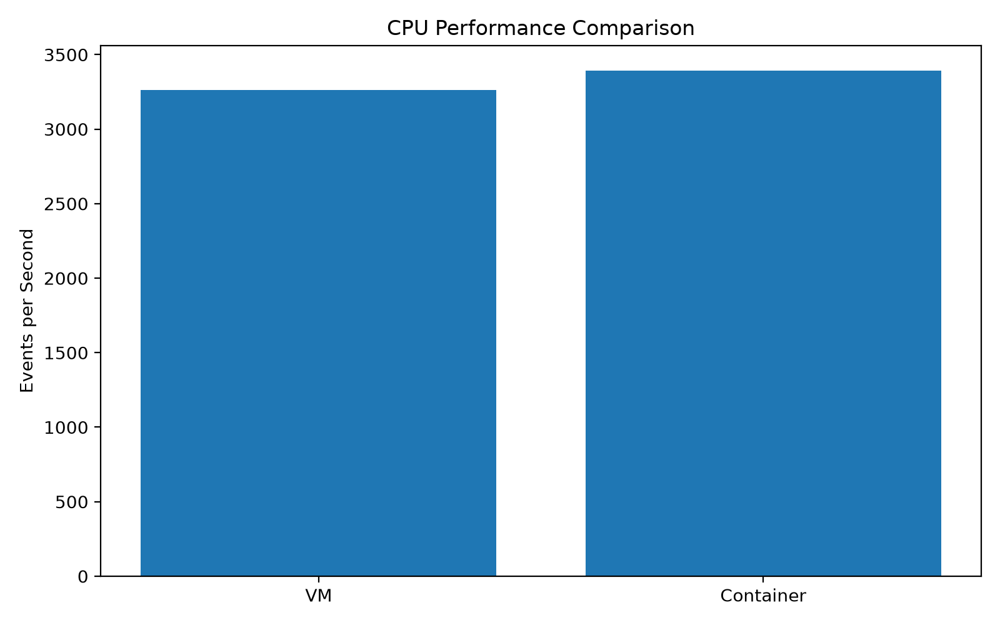

---

# 18. Network Performance Graph

Network throughput was measured using `iperf3`.

The VM and container results can be compared using the graph below.

### Network Throughput Comparison

```text
results/figures/02-network-comparison.png
```


The measured final container network throughput was approximately **64.8 Gbit/s**, while the VM measurement was approximately **64–66 Gbit/s**.

---

# 19. Memory Performance Graph

The container memory performance can be represented using a graph.

### Container Memory Performance

```text
results/figures/03-container-memory-performance.png
```


The container was configured with a memory limit of approximately **512 MB**.

---

# 20. Disk I/O Performance Graphs

Disk performance was evaluated using `fio`.

The following operations were tested:

* Sequential Read
* Sequential Write
* Random Read
* Random Write

The graph should compare the measured values obtained from:

* VM
* Container

### Recommended Graph

```text
results/figures/04-disk-io-comparison.png
```


> Use the actual values obtained from the `fio` experiment when generating this graph.

---

# 21. Overall Performance Comparison

A combined comparison can be represented as:

```text
                   VM vs Container
                         │
        ┌────────────────┼────────────────┐
        │                │                │
       CPU             Memory            Disk
        │                │                │
    Sysbench         Memory Test          fio
        │                │                │
        └────────────────┼────────────────┘
                         │
                      Network
                         │
                       iperf3
                         │
                    Application
                         │
                      FastAPI
```

### Comparison Table

| Performance Area | VM            | Container    | Tool             |
| ---------------- | ------------- | ------------ | ---------------- |
| CPU              | Measured      | Measured     | Sysbench         |
| Memory           | Measured      | Measured     | Memory Benchmark |
| Sequential Read  | Measured      | Measured     | fio              |
| Sequential Write | Measured      | Measured     | fio              |
| Random Read      | Measured      | Measured     | fio              |
| Random Write     | Measured      | Measured     | fio              |
| Network          | ~64–66 Gbit/s | ~64.8 Gbit/s | iperf3           |
| Application      | Verified      | Verified     | FastAPI          |

---

# 22. Performance Graph Summary

The GitHub repository should contain the following graphs:

| Graph                        | File                                  |
| ---------------------------- | ------------------------------------- |
| CPU Comparison               | `01-cpu-comparison.png`               |
| Network Comparison           | `02-network-comparison.png`           |
| Container Memory Performance | `03-container-memory-performance.png` |
| Disk I/O Comparison          | `04-disk-io-comparison.png`           |

Recommended location:

```text
results/
└── figures/
    ├── 01-cpu-comparison.png
    ├── 02-network-comparison.png
    ├── 03-container-memory-performance.png
    └── 04-disk-io-comparison.png
```

---

# 23. Benchmark Data

The numerical benchmark values used to generate the graphs should be stored in a CSV file.

Recommended location:

```text
results/
└── processed/
    └── benchmark_results.csv
```

Example structure:

```csv
Category,Environment,Metric,Value,Unit
CPU,VM,Events per second,<actual_value>,events/s
CPU,Container,Events per second,<actual_value>,events/s
Memory,Container,Memory Performance,<actual_value>,MB/s
Disk,VM,Sequential Read,<actual_value>,MB/s
Disk,Container,Sequential Read,<actual_value>,MB/s
Network,VM,Throughput,<actual_value>,Gbit/s
Network,Container,Throughput,64.8,Gbit/s
```

> Replace `<actual_value>` with the values obtained from the real experiment.

---

# 24. Graph Generation

A Python script can be used to generate the performance graphs from the CSV data.

Recommended location:

```text
results/
└── processed/
    └── generate_graphs.py
```

The workflow is:

```text
Benchmark Results
       ↓
benchmark_results.csv
       ↓
Python Graph Script
       ↓
Performance Graphs
       ↓
results/figures/
       ↓
GitHub README
```

---

# 25. Observation

The experiment demonstrates the following observations:

1. Both VMs and containers can provide isolated execution environments for applications.
2. A VM provides a complete operating-system environment.
3. Containers share the host kernel and therefore use a different isolation model.
4. Docker allows explicit CPU and memory resource limits to be configured.
5. CPU, memory, disk, and network performance can be measured using standard benchmarking tools.
6. The measured network throughput of the VM and container was close in the final test.
7. The FastAPI application successfully executed inside the container.

All observations are based on the measurements and screenshots collected during the experiment.

---

# 26. Experimental Evidence

All experiment screenshots are stored in the `screenshots` directory.

## System and Configuration

```text
01-docker-hello-world.png
02-lscpu-system-info.png
03-memory-and-storage-info.png
04-disk-and-docker-info.png
05-vm-configuration.png
06-docker-configuration.png
```

## Container and Benchmark Setup

```text
07-baseline-cpu-sysbench.png
08-benchmark-dockerfile.png
09-benchmark-docker-image.png
10-container-tools-verification.png
```

## CPU and Memory

```text
11-vm-cpu-result.png
12-container-cpu-result.png
13-container-memory-result.png
```

## Disk

```text
14-vm-disk-results.png
15-container-disk-results.png
```

## Network

```text
16-vm-network-iperf3.png
17-container-network-iperf3.png
```

## Application

```text
18-fastapi-health.png
19-fastapi-compute.png
20-fastapi-container-running.png
21-container-fastapi-endpoints.png
```

---

# 27. Experimental Evidence Gallery

## System Configuration

### Docker Hello World

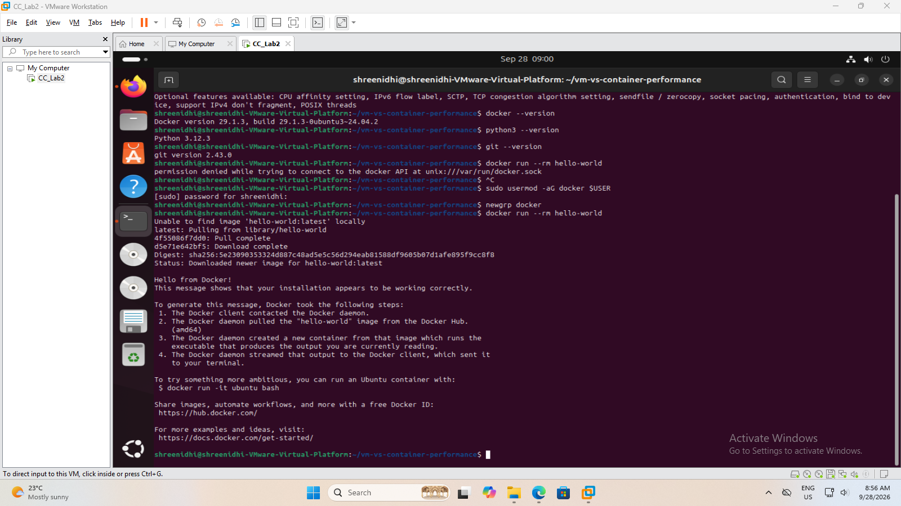

### CPU and System Information

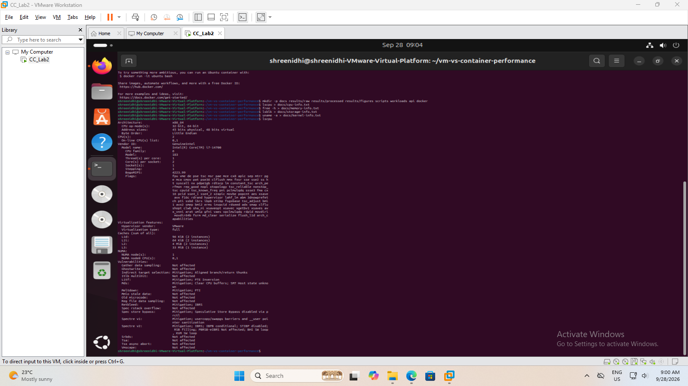

### Memory and Storage

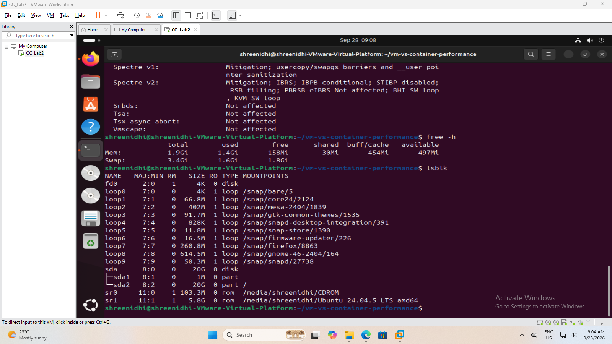

### Docker Configuration

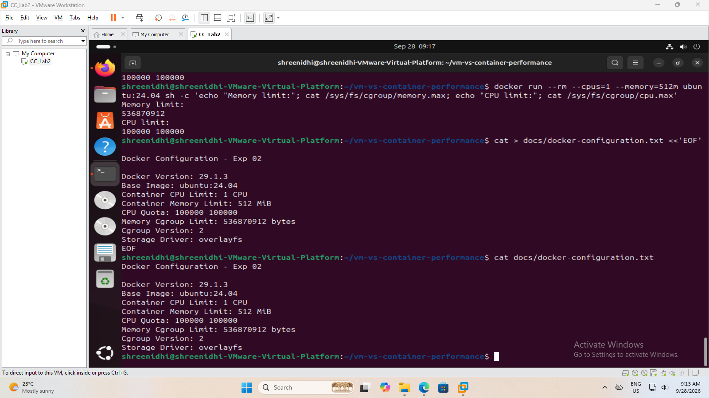

---

## CPU Benchmark Results

### VM CPU Result

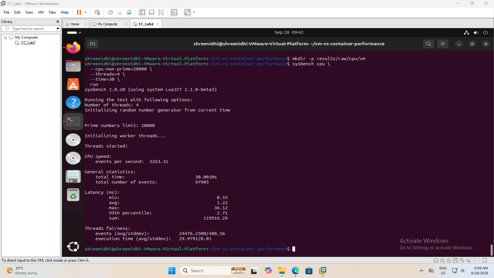

### Container CPU Result

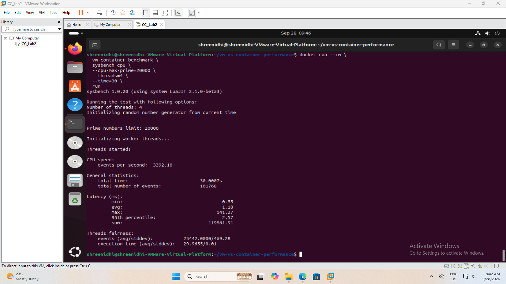

---

## Memory Result

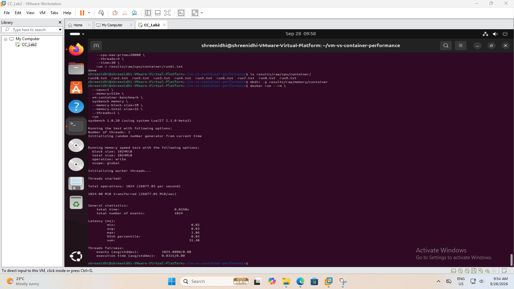

---

## Disk I/O Results

### VM Disk Result

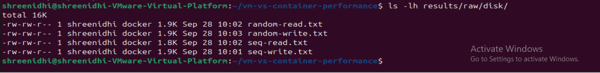

### Container Disk Result

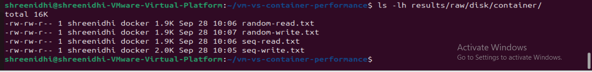

---

## Network Results

### VM Network Result

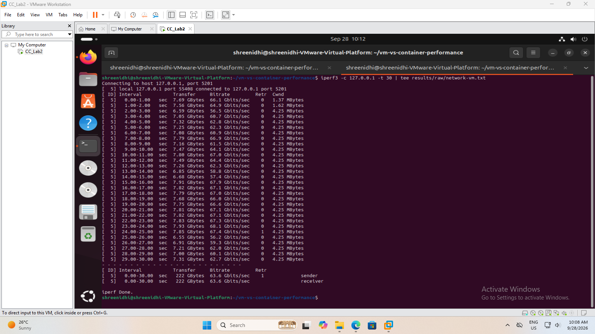

### Container Network Result


---

## FastAPI Application

### FastAPI Health

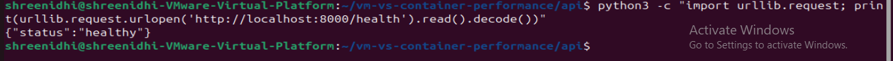

### FastAPI Compute

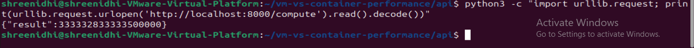

### Container Running

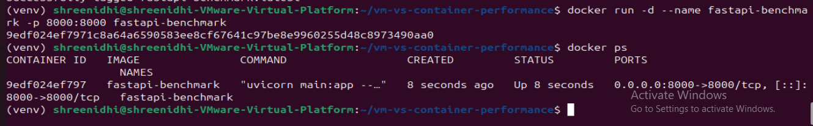

### FastAPI Endpoints

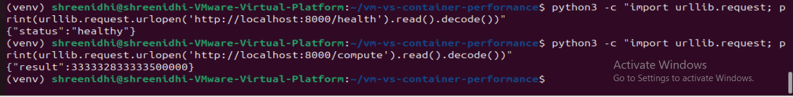

---

# 28. Conclusion

The experiment successfully evaluated **VM and container environments** using CPU, memory, disk I/O, network, and application-level tests.

The VM environment was configured and verified, while Docker was used to create a controlled container environment.

The following benchmarking tools were used:

* `sysbench` for CPU performance
* `fio` for disk I/O performance
* `iperf3` for network performance
* FastAPI for application-level testing

The FastAPI application was successfully executed inside the container, confirming application-level functionality.

The measured network throughput of the VM and container was close during the final test.

The experiment provides a practical comparison of VM-based and container-based execution environments and demonstrates how resource configuration and benchmarking can be used to analyze cloud computing performance.

---

# 29. VM vs Container — Final Comparison

| Feature                    | Virtual Machine           | Docker Container              |
| -------------------------- | ------------------------- | ----------------------------- |
| Virtualization Level       | Hardware / OS level       | Application level             |
| Operating System           | Complete guest OS         | Shares host kernel            |
| Isolation                  | Strong OS-level isolation | Process/application isolation |
| Startup Time               | Relatively higher         | Generally faster              |
| Resource Usage             | Higher                    | Lower                         |
| CPU Testing                | Sysbench                  | Sysbench                      |
| Memory Testing             | Measured                  | Measured                      |
| Disk Testing               | fio                       | fio                           |
| Network Testing            | iperf3                    | iperf3                        |
| Application Testing        | VM environment            | FastAPI container             |
| Resource Limits            | VM configuration          | Docker/cgroup limits          |
| Memory Limit in Experiment | ~1.9 GiB VM               | 512 MB container              |
| CPU Allocation             | 2 vCPUs                   | 1 CPU                         |

---

# 30. Final Experimental Workflow

```text
SYSTEM SETUP
     ↓
VM CONFIGURATION
     ↓
DOCKER CONFIGURATION
     ↓
CONTAINER CREATION
     ↓
CPU BENCHMARK
     ↓
MEMORY BENCHMARK
     ↓
DISK I/O BENCHMARK
     ↓
NETWORK BENCHMARK
     ↓
FASTAPI APPLICATION TEST
     ↓
RESULT COLLECTION
     ↓
GRAPH GENERATION
     ↓
PERFORMANCE ANALYSIS
     ↓
CONCLUSION
```

---

# 31. Repository Structure

```text
02-VM-Container-Performance/
│
├── README.md
│
├── screenshots/
│   ├── 01-docker-hello-world.png
│   ├── 02-lscpu-system-info.png
│   ├── 03-memory-and-storage-info.png
│   ├── 04-disk-and-docker-info.png
│   ├── 05-vm-configuration.png
│   ├── 06-docker-configuration.png
│   ├── 07-baseline-cpu-sysbench.png
│   ├── 08-benchmark-dockerfile.png
│   ├── 09-benchmark-docker-image.png
│   ├── 10-container-tools-verification.png
│   ├── 11-vm-cpu-result.png
│   ├── 12-container-cpu-result.png
│   ├── 13-container-memory-result.png
│   ├── 14-vm-disk-results.png
│   ├── 15-container-disk-results.png
│   ├── 16-vm-network-iperf3.png
│   ├── 17-container-network-iperf3.png
│   ├── 18-fastapi-health.png
│   ├── 19-fastapi-compute.png
│   ├── 20-fastapi-container-running.png
│   └── 21-container-fastapi-endpoints.png
│
└── results/
    │
    ├── figures/
    │   ├── 01-cpu-comparison.png
    │   ├── 02-network-comparison.png
    │   ├── 03-container-memory-performance.png
    │   └── 04-disk-io-comparison.png
    │
    ├── data/
    │
    └── processed/
        ├── benchmark_results.csv
        └── generate_graphs.py
```

---

# 32. Final Deliverables

The completed experiment contains:

* Experiment documentation
* VM configuration evidence
* Docker configuration evidence
* Container setup evidence
* CPU benchmark results
* Memory benchmark results
* Disk I/O results
* Network benchmark results
* FastAPI application testing
* 21 experimental screenshots
* CPU performance graph
* Network performance graph
* Memory performance graph
* Disk I/O performance graph
* Benchmark CSV data
* Graph-generation Python script
* Performance analysis
* Final comparison
* Conclusion
* Organized GitHub repository structure

---

# 33. Author

**Name:** Sanket

**Course:** Cloud Computing

**Institution:** KLE Technological University

**Academic Year:** 2026

