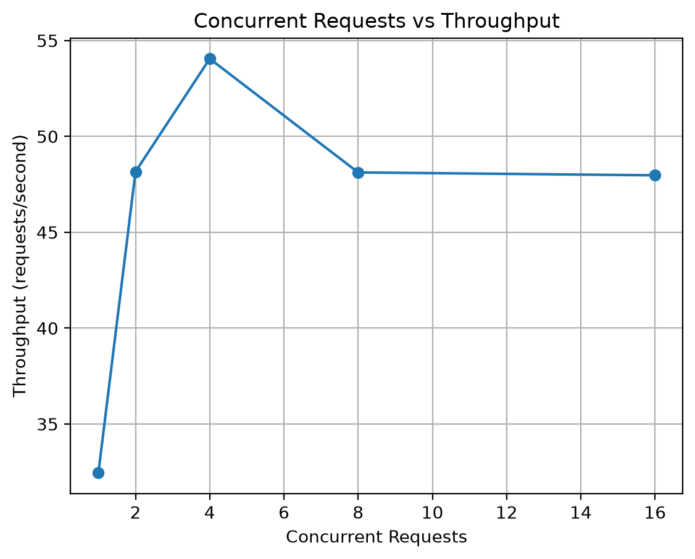
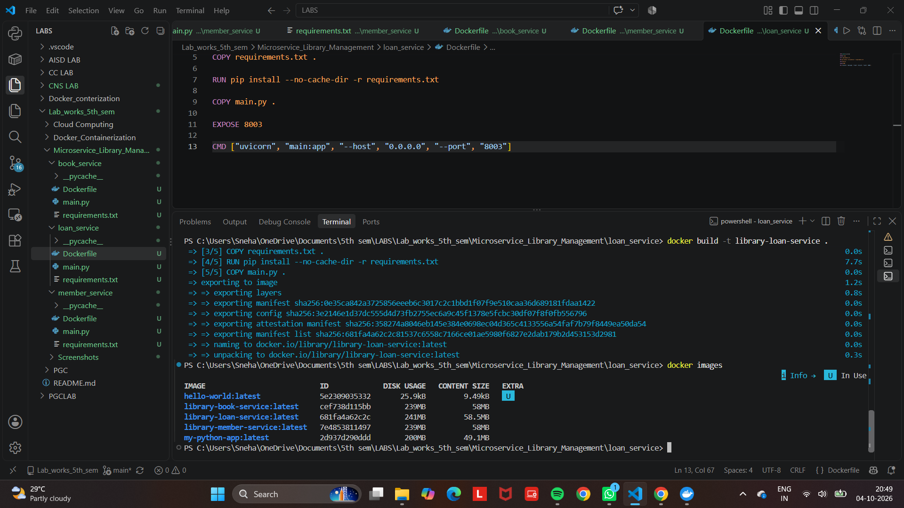
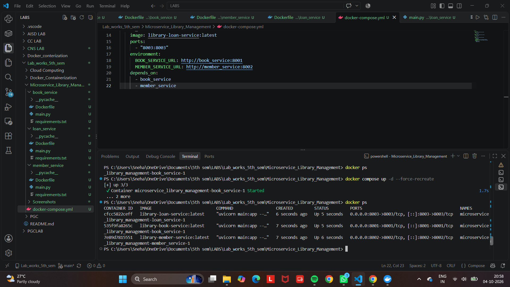

# Library Management System - Microservices

## Overview

This project implements a **Library Management System using a Microservices Architecture**.

The application is divided into three independent microservices:

1. **Book Service** - manages library books and their availability.
2. **Member Service** - manages library member information.
3. **Loan Service** - manages borrowing and returning of books and communicates with the Book Service and Member Service.

Each microservice is independently developed and exposed through REST APIs. The services are containerized using Docker and deployed together using Docker Compose.

**Tech stack:** Python, FastAPI, httpx, Docker, Docker Compose

---

## Architecture

```text
                        Client
                          |
                          v
                 +-----------------+
                 |  Loan Service   |
                 |     :8003       |
                 +-----------------+
                   |             |
                   v             v
         +---------------+  +----------------+
         | Book Service  |  | Member Service |
         |    :8001      |  |     :8002      |
         +---------------+  +----------------+

      All three containers run on the Docker network "library_net"
```

### Microservices

| Service | Responsibility | Port |
|---|---|---:|
| Book Service | Book management and availability | 8001 |
| Member Service | Library member management | 8002 |
| Loan Service | Borrowing and returning books | 8003 |

---

## Book Service

The **Book Service** is responsible for managing library books and their availability.

### Responsibilities

- Store and provide book details.
- Retrieve the list of books along with their availability.
- Retrieve details of a specific book.
- Reserve a book when it is borrowed and release it when it is returned.

### REST Endpoints

| Method | Endpoint | Description |
|---|---|---|
| GET | `/` | Check Book Service status |
| GET | `/health` | Health check used by Docker Compose |
| GET | `/books` | Retrieve all books |
| GET | `/books/{book_id}` | Retrieve a specific book |
| POST | `/books/{book_id}/reserve` | Mark a book as borrowed (returns 409 if it is already borrowed) |
| POST | `/books/{book_id}/release` | Mark a book as available again |
| PUT | `/books/{book_id}/availability?available=true/false` | Set availability manually |

### Port

```text
http://localhost:8001
```

---

## Member Service

The **Member Service** is responsible for managing library member information.

### Responsibilities

- Store and provide library member details.
- Retrieve the list of registered members.
- Retrieve details of a specific member.
- Provide member information required during the book borrowing process.

### REST Endpoints

| Method | Endpoint | Description |
|---|---|---|
| GET | `/` | Check Member Service status |
| GET | `/health` | Health check used by Docker Compose |
| GET | `/members` | Retrieve all members |
| GET | `/members/{member_id}` | Retrieve a specific member |

### Port

```text
http://localhost:8002
```

---

## Loan Service

The **Loan Service** is responsible for managing the borrowing and returning of library books.

### Responsibilities

- Borrow books for registered library members.
- Return borrowed books.
- Maintain loan details and loan status.
- Communicate with the Book Service to verify and reserve books.
- Communicate with the Member Service to verify member details.

### REST Endpoints

| Method | Endpoint | Description |
|---|---|---|
| GET | `/` | Check Loan Service status |
| GET | `/health` | Health check used by Docker Compose |
| GET | `/loans` | Retrieve all loan records |
| GET | `/loans/check/{book_id}/{member_id}` | Check whether a member can borrow a book (read-only, calls both services) |
| POST | `/loans/borrow` | Borrow a book |
| POST | `/loans/return/{loan_id}` | Return a borrowed book |

### Port

```text
http://localhost:8003
```

---

## Inter-Service Communication

The **Loan Service** communicates with the **Book Service** and **Member Service** to complete the borrowing process.

When a member requests to borrow a book:

1. The Loan Service receives the borrow request.
2. It calls the **Book Service** and the **Member Service** at the same time to verify the book and the member.
3. If the member is active, it asks the Book Service to **reserve** the book.
4. The Book Service reserves the book only if it is still available, so two members cannot borrow the same book at the same moment.
5. The Loan Service creates the loan record and returns it to the client.

### Docker Service Communication

When the services are running using Docker Compose, the Loan Service communicates with the other services using their **Docker Compose service names** instead of `localhost`.

```text
Loan Service
     |
     +----> http://book_service:8001
     |
     +----> http://member_service:8002
```

The following environment variables are used:

```text
BOOK_SERVICE_URL=http://book_service:8001
MEMBER_SERVICE_URL=http://member_service:8002
```

All three services are connected to the same Docker network, `library_net`, created by Docker Compose.

---

## Optimisations

| Optimisation | Before | After |
|---|---|---|
| HTTP connections | A new HTTP client was created for every call (3 per borrow) | One shared HTTP client; connections are reused |
| Book and Member checks | Called one after the other | Called in parallel with `asyncio.gather` |
| Double borrowing | 16 simultaneous borrows of the same book created 16 loans | Atomic `reserve` in Book Service; only 1 of 16 succeeds |
| Data lookups | Linear search through a list | Dictionary lookup by id |
| Error handling | Unexpected responses from other services could crash the Loan Service | Clean 400 / 404 / 502 / 503 errors |
| Startup order | `depends_on` only controlled start order | Health checks; Loan Service starts only after the other two are healthy |
| Builds | Unpinned dependency versions | Pinned versions for repeatable builds |

---

## Dockerization

Each microservice is containerized using Docker. A separate Dockerfile is provided for each service.

### Docker Images

| Service | Docker Image | Container Name | Port |
|---|---|---|---:|
| Book Service | `library-book-service:latest` | `book_service` | 8001 |
| Member Service | `library-member-service:latest` | `member_service` | 8002 |
| Loan Service | `library-loan-service:latest` | `loan_service` | 8003 |

### Docker Compose

Docker Compose is used to build and run all three microservices together. Each service has a `build` path, an `image` name, a health check, and is connected to the `library_net` network.

```yaml
name: library-management

services:

  book_service:
    build: ./book_service
    image: library-book-service:latest
    container_name: book_service
    ports:
      - "8001:8001"
    networks:
      - library_net
    healthcheck:
      test: ["CMD", "python", "-c", "import urllib.request; urllib.request.urlopen('http://localhost:8001/health')"]
      interval: 5s
      timeout: 3s
      retries: 5

  member_service:
    build: ./member_service
    image: library-member-service:latest
    container_name: member_service
    ports:
      - "8002:8002"
    networks:
      - library_net
    healthcheck:
      test: ["CMD", "python", "-c", "import urllib.request; urllib.request.urlopen('http://localhost:8002/health')"]
      interval: 5s
      timeout: 3s
      retries: 5

  loan_service:
    build: ./loan_service
    image: library-loan-service:latest
    container_name: loan_service
    ports:
      - "8003:8003"
    environment:
      BOOK_SERVICE_URL: http://book_service:8001
      MEMBER_SERVICE_URL: http://member_service:8002
    networks:
      - library_net
    depends_on:
      book_service:
        condition: service_healthy
      member_service:
        condition: service_healthy

networks:
  library_net:
    driver: bridge
```

---

## API Testing and End-to-End Communication

### Book Service

```text
GET http://localhost:8001/books
```

### Member Service

```text
GET http://localhost:8002/members
```

### Loan Service

```text
POST http://localhost:8003/loans/borrow
```

with the following request body:

```json
{
  "book_id": 1,
  "member_id": 1
}
```

The request was successfully processed through the Loan Service, which communicated with the Book Service and Member Service.

### Successful Borrow Operation

The borrow request returned a successful response with:

- Book: The Alchemist
- Member: Sneha
- Status: borrowed
- Response: 200 OK

### Book Return

```text
POST http://localhost:8003/loans/return/1
```

The return operation was successful, and the book became available again in the Book Service.

---

## Performance Testing

The performance of the microservices was evaluated using different workload levels with increasing concurrency.

A total of **5 workload levels** were tested with concurrency levels of **1, 2, 4, 8, and 16**.

### Test Setup

- Requests per workload: **200** (5 workloads x 200 = 1000 requests in total)
- Concurrency levels: 1, 2, 4, 8, 16
- Endpoint under load: **`GET http://127.0.0.1:8001/books`** (Book Service)
- CPU and memory measured on: **all three containers** using `docker stats`. The table shows the average of the three; per-container values are in `Performance/performance_results.csv`.
- Load test script: `Performance/load_test.py`
- These measurements were taken before the optimisations listed above.

### Workload Results

| Workload | Concurrent Requests | Average Response Time (ms) | Throughput (req/s) | Successful Requests | Failed Requests | Average CPU (%) | Average Memory (MB) |
|---|---:|---:|---:|---:|---:|---:|---:|
| W1 | 1 | 12.40 | 32.45 | 200 | 0 | 1.91 | 35.27 |
| W2 | 2 | 11.95 | 48.16 | 200 | 0 | 0.67 | 35.29 |
| W3 | 4 | 8.37 | 54.05 | 200 | 0 | 0.20 | 35.35 |
| W4 | 8 | 9.71 | 48.12 | 200 | 0 | 0.25 | 35.41 |
| W5 | 16 | 15.31 | 47.97 | 200 | 0 | 0.26 | 35.51 |

### CPU and Memory per Microservice

| Workload | Book CPU (%) | Member CPU (%) | Loan CPU (%) | Book Memory (MB) | Member Memory (MB) | Loan Memory (MB) |
|---|---:|---:|---:|---:|---:|---:|
| W1 | 5.31 | 0.20 | 0.21 | 35.76 | 34.56 | 35.49 |
| W2 | 1.56 | 0.21 | 0.24 | 35.81 | 34.56 | 35.49 |
| W3 | 0.20 | 0.20 | 0.21 | 35.99 | 34.56 | 35.49 |
| W4 | 0.27 | 0.24 | 0.23 | 36.19 | 34.56 | 35.49 |
| W5 | 0.27 | 0.26 | 0.24 | 36.47 | 34.56 | 35.49 |

### Performance Summary

- Total requests tested: **1000** (200 per workload)
- Successful requests: **1000**
- Failed requests: **0**
- Lowest average response time: **8.37 ms** at concurrency 4.
- Highest throughput: **54.05 requests/second** at concurrency 4.
- Average memory usage remained approximately **35 MB** across the workloads.
- CPU utilization remained low during the tests.

### Performance Graphs

#### Concurrent Requests vs Average Response Time


#### Concurrent Requests vs Throughput



#### Concurrent Requests vs CPU Utilization


#### Concurrent Requests vs Memory Utilization


The detailed performance results are available in:

`Performance/performance_results.csv`

### End-to-End Load Test for the Optimised Version

`load_test.py` (in the project folder) tests the full path Client → Loan → Book + Member using `GET /loans/check/1/1`, for 20 seconds at each concurrency level, and samples `docker stats` for all three containers:

```bash
pip install httpx matplotlib
python load_test.py
```

It produces `results.md` (observation table), `results.csv` and four graphs (`graph_response_time.png`, `graph_throughput.png`, `graph_cpu.png`, `graph_memory.png`).

---

## Performance Analysis

The workload testing results show that the system handled all tested concurrency levels successfully.

### Observations

- All **1000 requests** were completed successfully with **0 failures**.
- Average response time fell from 12.40 ms at concurrency 1 to its lowest value of **8.37 ms** at concurrency 4, then rose to 9.71 ms at concurrency 8 and **15.31 ms** at concurrency 16.
- Throughput peaked at **54.05 requests/second** at concurrency 4 and was about 48 requests/second at concurrency 2, 8 and 16, so adding concurrency beyond 4 did not improve throughput.
- CPU utilization remained low in every workload (at most 1.91% on average).
- Memory utilization remained nearly stable at approximately **35 MB** (35.27 MB to 35.51 MB).

### Which Microservice Consumes More Resources

- The **Book Service** used the most resources: its CPU reached **5.31%** at W1, while Member and Loan stayed around 0.2%. Its memory also grew slightly, from 35.76 MB to **36.47 MB**, while the other two stayed constant.
- This is expected, because the load test sent every request directly to the Book Service (`GET /books`). The Member and Loan services were idle during this test.

### Performance Degradation

- Beyond concurrency 4, response time increased (to 15.31 ms at concurrency 16) while throughput stopped increasing. Each service runs a single Uvicorn worker, so extra concurrent requests wait in a queue instead of being processed faster.
- No requests failed at any workload level, so the services were not overloaded at 16 concurrent requests.

### Performance Conclusion

All five workloads completed with 100% request success. In these tests, concurrency 4 gave the best result, with the lowest response time and the highest throughput. Beyond concurrency 4, response time grew while throughput settled at about 48 requests/second.

---

## Screenshots

### Docker Images and Containers






### End-to-End Communication


---

## Project Structure

```text
01 - Microservice_Library_Management/
│
├── book_service/
│   ├── Dockerfile
│   ├── main.py
│   └── requirements.txt
│
├── member_service/
│   ├── Dockerfile
│   ├── main.py
│   └── requirements.txt
│
├── loan_service/
│   ├── Dockerfile
│   ├── main.py
│   └── requirements.txt
│
├── Performance/
│   ├── load_test.py
│   ├── generate_graphs.py
│   ├── performance_results.csv
│   ├── performance_observation_table.csv
│   ├── response_time.png
│   ├── throughput.png
│   ├── cpu_utilization.png
│   └── memory_utilization.png
│
├── Screenshots/
│   ├── 01_three_microservices_running.png
│   ├── 02_all_three_docker_images.png
│   ├── 03_all_three_containers_running.png
│   ├── 04_end_to_end_borrow.png
│   ├── 05_book_service_docker_image.png
│   ├── 06_book_and_member_docker_images.png
│   ├── 07_all_three_docker_images.png
│   ├── 08_three_containers_running.png
│   ├── 09_docker_compose_services_running.png
│   ├── 10_book_return_success.png
│   └── 11_book_available_after_return.png
│
├── docker-compose.yml
├── load_test.py
└── README.md
```

---

## How to Run the Project

### Prerequisites

Docker with Docker Compose v2 (the `docker compose` command) installed and running.

### Step 1: Build and Start the Docker Services

```bash
docker compose up -d --build
```

### Step 2: Check Running Containers

```bash
docker ps
```

You should see three containers named `book_service`, `member_service` and `loan_service`, with status `Up (healthy)`.

### Step 3: Check the Network

```bash
docker network inspect library-management_library_net
```

All three containers should be listed under `Containers`.

### Step 4: Test the Services

```text
Book Service:    GET http://localhost:8001/books
Member Service:  GET http://localhost:8002/members
Loan Service:    GET http://localhost:8003/
End-to-end:      GET http://localhost:8003/loans/check/1/1
```

### Step 5: Stop the Services

```bash
docker compose down
```

---

## Conclusion

The Library Management System was successfully implemented using a **Microservices Architecture** consisting of three independent services: **Book Service, Member Service, and Loan Service**.

The project demonstrates:

- Independent REST APIs for each microservice.
- Dockerization of all three microservices.
- Deployment using Docker Compose with health checks on a dedicated network.
- Inter-service communication using Docker service names.
- Successful book borrowing and returning operations.
- Optimised inter-service calls (shared connections, parallel requests, atomic reservation).
- Successful execution of workload testing at five different concurrency levels.
- Performance monitoring of response time, throughput, CPU utilization, and memory utilization.

The system achieved **100% request success** during the performance testing, demonstrating that the microservices were able to handle the tested workloads successfully.

---

## References

- Microservice Lab Evaluation Manual
- [FastAPI Documentation](https://fastapi.tiangolo.com/)
- [Docker Documentation](https://docs.docker.com/)
- [Docker Compose Documentation](https://docs.docker.com/compose/)

---

## Author

**Sneha Shettar**

**Bhoomi Bankapur**

**Sanket U**
5th Semester – Cloud Computing Lab

KLE Technological University
